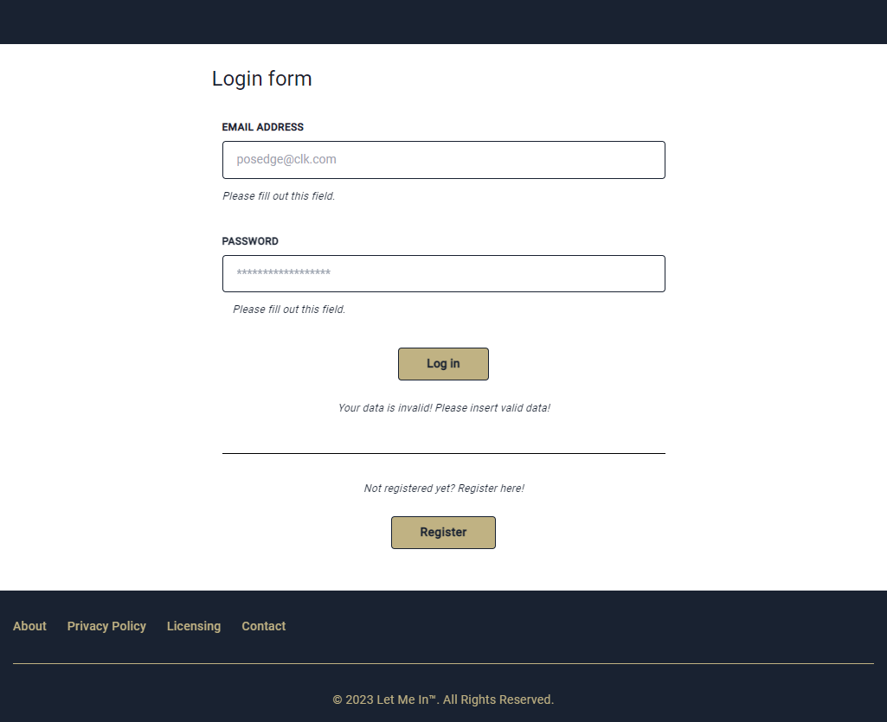
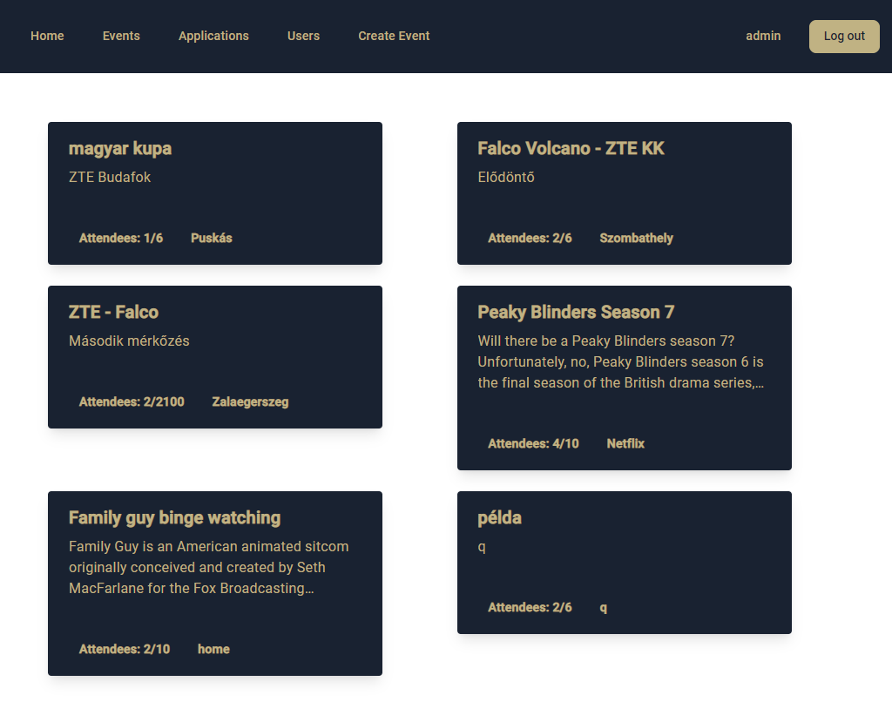
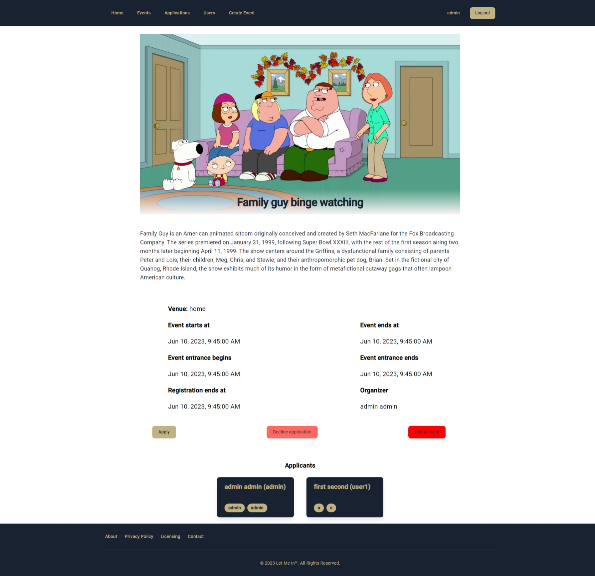
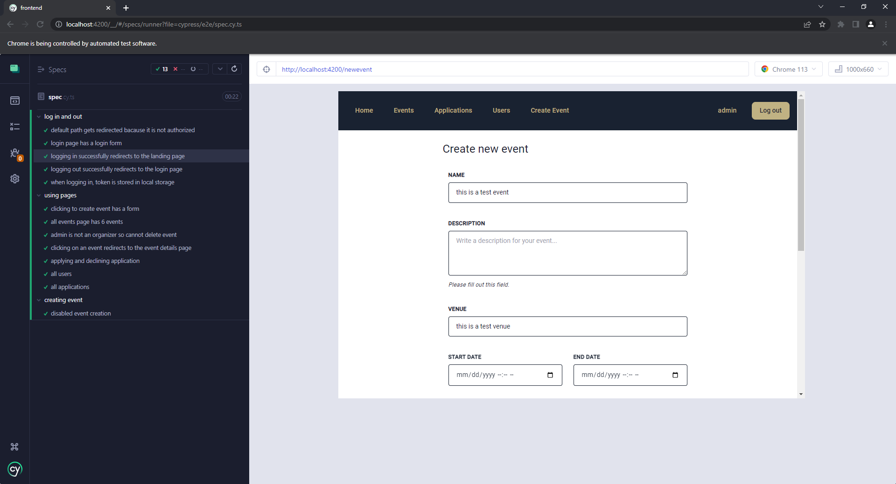

# Let Me In - Event Management Application
Event management software based on Spring Framework Backend and Angular frontend

# Final product

## Login page

Authentication is provided via JWT tokens generated by backend.

## Event page

Design could be better have to admit :)

## Event details page

Applicants are shown real time ;)

## E2E testing in Cypress

